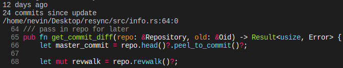

## Resync



Resync is a multi language comment checker written in rust. It's a CLI tool which uses the git history of your repo to detect out of sync comments.

Resync looks at things such as the commit dates, and commit consistency to tell if a comment is stale or not.

Note: resync may not be 100% accurate at identifying out of sync comments, it tries to only show you places where the function has been updated a lot, but the comment hasn't.

### Using Resync

To use resync, simply run `resync` in the root of any source code directory. This will check all files in the directory for out of sync comments.

You can check a single file by running `resync -i relative/file/location` from the root of a project.

The reason you need to run resync in the root of a project directory is because resync needs to open the .git folder.

### Installing

Head over to the [releases](https://github.com/ReadableLabs/resync/releases) page to download resync. If there aren't compiled binaries for your system, then you can compile resync in the following way.

```
git clone git@github.com:ReadableLabs/resync

cd resync

cargo install --path .
```

### Supported Languages

- [x] Rust
- [x] Javscript
- [x] JavaScript React
- [x] Typescript
- [ ] Typescript React
- [ ] C
- [ ] C++
- [ ] C#
- [ ] Python
- [ ] PHP
- [ ] Kotlin
- [ ] Java

If you want to support a new language, view the [docs](./docs/parsers.md) on how to do so.

### FAQ

- Resync outputs "Searching for out of sync comments..." but nothing else
  - Resync didn't find any out of sync comments in your project.

### Current

- Python support

### TODO

- Use [cursive](https://github.com/gyscos/cursive) to make a terminal GUI for resync
- use optional dependencies if you only want to compile for a few languages
- Allow resync to be used on the master branch, without creating resync branch (maybe)
- add tests to mock extension
